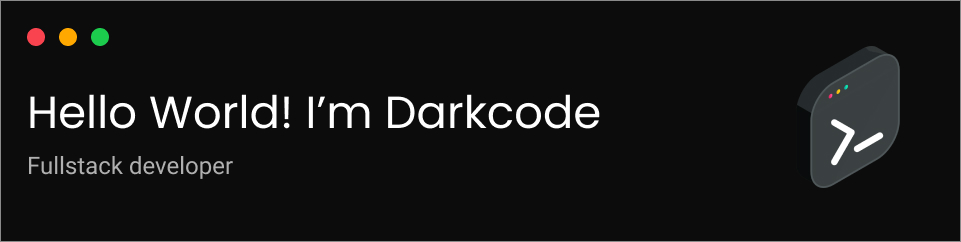

  

<h2></h2>

  
  
  
  
  
  
  
  
  
  
  
  
  
  

 

  

 

 Atualmente curso Análise e Desenvolvimento de Sistema na faculdade na Fatec de Taquaritinga, estudo front-end online no curso da Origamid, também estudo Python através de um curso da Udemy. Busco sempre aprimorar minhas habilidades afim de me tornar um desenvolvedor fullstack web, software e games. Além da minha parte profissonal, gosto de desenhar em meu tempo livre, faço aulas de violino e sou um fotógrafo amador. 

 
 

  
  

