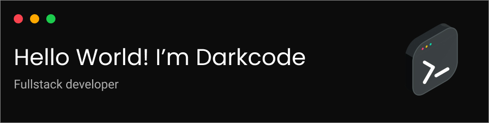
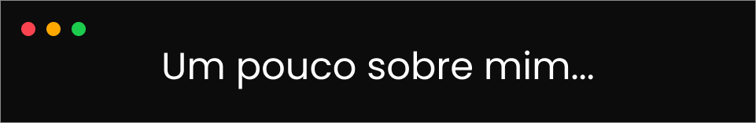

  

 

  
  
  
  
  
  
  
  
  
  
  
  

 

  

 

 Atualmente curso Análise e Desenvolvimento de Sistema na Fatec de Taquaritinga. Além da faculdade, estou buscando aprimorar minhas habilidades em programação através de cursos online em plataformas como DIO e Udemy, para que consiga alcançar meu objetivo de me tornar um desenvolvedor fullstack senior, especializado em desenvolvimento web, software e games. Além da minha parte profissonal, gosto de desenhar em meu tempo livre, faço aulas de violino e quando tenho oportunidade gosto de fotografar. 

 

  
  

 
 

  
  

